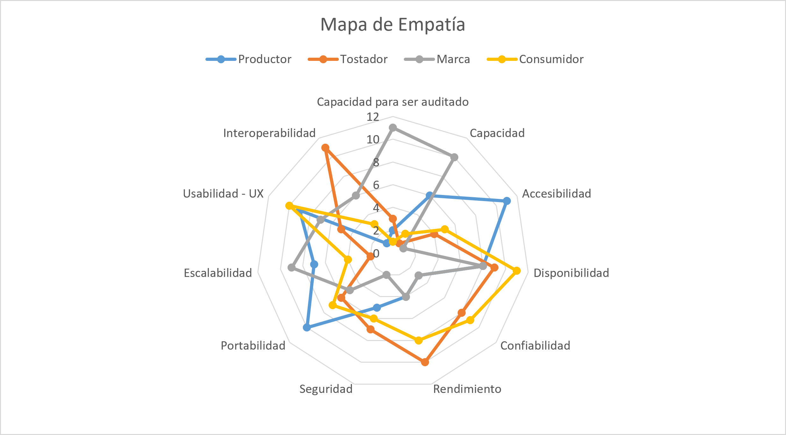

# Driver Arquitectónicos: Ruta de Origen

> **Versión:** 1.0 &nbsp;&bull;&nbsp; **Estado:** Aprobado &nbsp;&bull;&nbsp; **Autor:** Juan Esteban Jaramillo Ramírez
---

## 1. Introducción y Contexto

**Ruta de Origen** es un proyecto con el fin de ayudar al gremio cafetero y a los consumidores de café, debido a que el interés por conocer el origen y la trazabilidad de café en Colombia ha crecido de manera notable debido a la curiosidad de las personas por los procesos dentro del cultivo, tostado y métodos de preparación. 

Por ello se busca permitir el registro y seguimiento de la información asociada en la cadena de café, desde su origen hasta el producto final, permitiendo a los actores involucrados documentar sus procesos y evidencias, mientras que los consumidores podrán observan dicha información por medio de un código QR creado especialmente para cada producto. 

> **¿El Problema?** 
> Muchas marcas de café actualmente tienen un espacio muy limitado para mostrar la trazabilidad de este café, por medio de una etiqueta impresa, en esta no es posible demostrar toda la información dentro de un proceso tan extenso como lo es la cadena completa del café, y no se ha registrado ningún software que ayude a los consumidores y actores involucrados tener una mejor forma para soportar lo planteado en una simple etiqueta.

Los drivers arquitectónicos, en este punto del ciclo de vida del software nos van a permitir identificar las necesidades más importantes del sistema desde un punto funcional, del negocio y de la calidad. Posteriormente, nos  ayudarían a tomar decisiones arquitectónicas y establecer características que deben ser priorizadas dentro de la solución.

---

## 2. Restricciones de Negocio (Business Constraints)

Definimos límites **no negociables** definidos por la organización, el mercado o el contexto comercial **Colombiano**.

| ID | Tipo | Restricción de Negocio | Justificación | Plan de Acción |
| :---: | :--- | :--- | :--- | :--- |
| **BC‑01** | Humano | Disponibilidad limitada de productor y/o marcas para participar en entrevistas y validaciones. | Para ser lo más útil para la cadena del café se necesitan reuniones, entrevistas o conversaciones con gente que tenga experiencia en la cadena del café, y también para lograr resolver dudas. | Conseguir diversos aliados desde las primeras etapas, para no depender directamente solo de un actor del gremio cafetero. |
| **BC‑02** | Humano | Depender de actores externos para validar el modelo de trazabilidad. | Al tener como función central del producto la trazabilidad del café, se necesita contar con el apoyo de personas con mayor experiencia en el mundo del café. | Desde que se inicia el proyecto, se deben buscar alianzas con gremios cafeteros que permitan validar modelos y cómo funciona exactamente la trazabilidad de un café de origen. |
| **BC‑03** | Legal | Cumplimiento de las regulaciones sobre la protección de datos. | De acuerdo con la **Ley 1581/2012** y el **Decreto 1377/2013**, cumpliendo el derecho de hábeas data, el usuario tiene el derecho de conocer su información en internet, y borrar esta información en caso de que lo solicite. | Definir desde un inicio qué datos va a recolectar la plataforma para así avisarle en los términos y condiciones qué se recopila, evitando problemas con el usuario posteriormente. |
| **BC‑04** | Legal | Regulación del contenido sobre fotos, videos y documentos cargados por el usuario. | De acuerdo con la **Ley 23/1982** y **Ley 1915/2018**, hay contenido que puede estar reservado bajo derechos de autor, haciendo que no todo contenido pueda ser divulgado públicamente fácilmente. | Se debe establecer condiciones de uso y autorización para el contenido cargado, diferenciando entre almacenamiento y publicación pública hacia el consumidor. |
| **BC‑05** | Legal | Cumplimiento comercial aduanero y de impuestos. | De acuerdo con el **Art. 91 de la Ley 633/2000**, se debe estar registrado y suministrar a la DIAN y la dirección de impuestos, información sobre transacciones económicas en los términos que la entidad lo requiera. | El sistema al recibir pagos por suscripción debe reportar legalmente mediante facturación electrónica todos los reportes a las entidades correspondientes, para realizar los debidos reportes de impuestos y transacciones económicas. |
| **BC‑06** | Presupuesto | Costo de operación debe ser sostenible frente a los ingresos esperados. | Si los servidores, almacenamiento y otros servicios cuestan más de lo que genera el producto, el producto no sería sostenible. | Controlar costos de infraestructura desde el primer prototipo, medir el consumo y definir límites de almacenamiento y uso. |
| **BC‑07** | Presupuesto | El almacenamiento de fotografías, videos y documentos debe mantenerse dentro de costos sostenibles. | Las evidencias son una parte importante de Ruta de Origen, lo que le da más confiabilidad al consumidor, lo que puede tener un crecimiento considerable de almacenamiento y costos. | Establecer límites de uso, optimizar archivos, utilizar almacenamiento adecuado y monitorear el crecimiento de datos. |
| **BC‑08** | Proceso | La información de trazabilidad debe poder mantenerse completa y confiable durante toda la cadena. | Si la información está incompleta o inconsistente, el principal valor de Ruta de Origen, que es la trazabilidad, pierde credibilidad frente a un consumidor final, lo que hace un poco inútil la visión del proyecto. | Definir un modelo mínimo de información, establecer responsables por etapa y utilizar mecanismos de validación antes de publicar la trazabilidad. |
| **BC‑09** | Proceso | El proceso de trazabilidad debe adaptarse a las diferentes formas de producción y comercialización del café. | Si la plataforma obliga a los actores a seguir un proceso que no representa su realidad, podrían abandonar el producto. | Validar el flujo con diferentes actores y diseñar procesos configurables sin perder una estructura mínima común. |
| **BC‑10** | Proceso | Debe existir continuidad de la trazabilidad cuando el café cambia de responsable. | Si se pierde una relación entre el lote, proceso, tostador y producto, la información deja de representar un recorrido real del café. | Mantener identificadores únicos y relaciones entre las diferentes etapas y actores de la cadena. |
| **BC‑11** | Tiempo | Proceso de investigación y validación puede ser extenso. | El desarrollo del producto podría obtener retrasos si las decisiones sobre las funcionalidades dependen de entrevistas o pruebas con usuarios. | Al no tener un límite de tiempo fijo para la entrega del proyecto, podemos tomar el cuidado de tomar decisiones que realmente ya estén conversadas con una persona con mayor conocimiento en el tema. |
| **BC‑12** | Tiempo | Las funcionalidades deben poder validarse antes de realizar una inversión importante en ellas. | Invertir tiempo en funcionalidades que posteriormente no van a representar una necesidad al sistema puede consumir recursos y retrasar la salida del producto. | Validar las ideas inicialmente mediante prototipos, entrevistas o pruebas pequeñas antes de realizar implementaciones de mayor alcance. |

---

## 3. Restricciones técnicas (Techinical Constraints)

Aspectos **netamente técnicos** definidos previamente por el **cliente** o **propias del proyecto**.

| ID | Tipo | Categoria | Restricción técnica | Justificación |
| :---: | :--- | :--- | :--- | :--- |
| **TC‑01** | Impuesta por el cliente | Transparencia de Información | La página pública del lote debe mostrar claramente qué información fue registrada manualmente por el usuario y qué fue capturada automáticamente por el sistema. | El consumidor final y potenciales consumidores de café de especiales necesitan poder distinguir entre datos declarados por el productor y datos verificados por el sistema para evaluar el nivel de confianza de la trazabilidad. |
| **TC‑02** | Impuesta por el cliente | Permanencia de QR | Los códigos QR generados por la plataforma deben seguir funcionando indefinidamente una vez impresos en un empaque físico. | Un código QR impreso en una bolsa de café es permanente: no puede ser modificado ni reemplazado desde que la bolsa ya esté en manos del consumidor o una tienda. Cualquier cambio en la estructura de URLs, dominio o lógica de redirección del sistema debe garantizar retrocompatibilidad con todos los QR previamente generados. Un QR que deja de funcionar representa una falla directa en la promesa de valor al consumidor y daña la credibilidad del tostador. |
| **TC‑03** | Impuesta por el cliente | Dispositivos | El sistema debe ser completamente funcional en cualquier dispositivo móvil sin importar su gama. | El perfil de un productor en Colombia corresponde mayoritariamente a celulares de gama baja. Restringir el soporte a dispositivos modernos excluiría a una parte fundamental de los usuarios para quienes está diseñada la plataforma. |
| **TC‑04** | Impuesta por el cliente | Conectividad | El sistema debe funcionar en condiciones limitadas de conectividad o intermitencia para los usuarios que registran información en zonas rurales. | Los productores en campo son los actores principales en la cadena de trazabilidad, y es donde más frecuentemente se encuentra una señal muy débil o inexistente. El sistema debería poder guardar los datos localmente y sincronizarlos cuando se recupere la conexión. |
| **TC‑05** | Propia del proyecto | Internacionalización | El sistema debe ser diseñado desde el inicio con soporte para múltiples idiomas. | Aunque el mercado inicial de Ruta de Origen sea Colombia y LATAM, la propuesta de valor apunta a mercados de exportación como Europa y Estados Unidos, donde el consumidor requerirá la página pública del lote en otros idiomas diferentes al español. Inclusive el mercado se puede ampliar, ya que no solo en LATAM se ve el café de origen, este viene principalmente de países como Etiopía, por lo que la propuesta de valor también puede interesar en un futuro allá. |
| **TC‑06** | Propia del proyecto | Accesibilidad | La interfaz debe cumplir criterios de accesibilidad para facilitar el acceso a cualquier persona según sus conocimientos técnicos. | La plataforma será usada por personas con distintos niveles de habilidad digital y potencialmente con diversidad funcional visual o motora. Se debe garantizar que el sistema sea usable por el mayor número posible de personas, incluyendo productores en campo que pueden usar el celular bajo la luz del sol u ocupados. |
| **TC‑07** | Propia del proyecto | Seguridad | Se debe priorizar el aislamiento de los datos entre las organizaciones. | La plataforma permite el ingreso a varias organizaciones, por lo que se debe garantizar que, al compartir la misma infraestructura, los datos deban ser invisibles entre sí, donde cada organización solo podrá ingresar, observar y modificar su propia información. |
| **TC‑08** | Propia del proyecto | Patrones de diseño | Propender por el uso de patrones de diseño e implementación como GoF, GRASP, DRY, KISS… | La plataforma maneja múltiples entidades relacionadas (fincas, lotes, etapas, usuarios, roles, QR, sensores) con comportamientos que se repiten en distintos contextos. Los patrones permiten estructurar esas relaciones de forma clara y reutilizable. Evitan que la lógica de trazabilidad esté duplicada en distintas partes del sistema y garantizan que soluciones simples se prefieran sobre arquitecturas innecesariamente complejas, lo que es especialmente relevante dado el tamaño actual del equipo. |
| **TC‑09** | Propia del proyecto | Prácticas de código limpio | Propender por la aplicación de código limpio (Clean Code), evitando *Messy Code* y *Code Smells*. | Ruta de Origen es construida inicialmente por un equipo pequeño, lo que hace que el código limpio sea aún más crítico: cada decisión de diseño debe ser comprensible sin necesidad de documentación adicional. |
| **TC‑10** | Propia del proyecto | Prácticas DevOps | Propender por el uso de prácticas DevOps. | La plataforma debe poder actualizarse con frecuencia sin interrumpir las páginas públicas de los lotes ni los QR ya generados e impresos en bolsas físicas. Las prácticas DevOps permiten automatizar pruebas, despliegues y monitoreo continuo, garantizando que cada nueva versión llegue a producción de forma segura, rápida y sin tiempo de inactividad. |

---

## 4. Funcionalidades Significativas (Significant Functions)

Requerimientos funcionales que **aportan** un gran **valor de negocio**, implica un **reto tecnológico** o no pueden aportar **ambos**. Nos ayuda a definir realmente que es lo que **diferencia** el software dentro el mercado comercio.

| ID | Especificación | Tipo | Justificación | Observación |
| :---: | :--- | :--- | :--- | :--- |
| **RF‑03** | Gestión de Procesos de Trazabilidad | Ambos | Este RF nos aporta valor, debido a que es básicamente el pilar fundamental de la idea de negocio, y nos permite registrar la historia y origen del café. Nos puede también aportar un reto técnico debido a que se requiere directamente una investigación con un productor, tostador y/o marca de café para tener claro cada uno de los procesos detrás de una bolsa de café. | Al hablar de historia de café o su origen, nos referimos a los procesos por los que pasa un producto terminado o "bolsa de café", desde lo que pasa por una finca, un proceso de tostión, hasta el empaque final del producto. |
| **RF‑04** | Registro de Evidencias | Valor de negocio | Este RF nos aporta un valor significativo al producto debido a que nos permite respaldar los datos que pueden ser simplemente texto, por medio de evidencias, lo que permite que el consumidor final de la "bolsa de café" pueda tener más confianza en la información que obtiene por medio de la plataforma. | Al referirnos a "evidencias" podemos hablar de documentos de certificación (como puede ser Rainforest u otras certificaciones de café), fotos, videos. |
| **RF‑08** | Consulta Pública de Trazabilidad | Valor de negocio | Esta RF nos aporta un valor importante al negocio, ya que permite que el consumidor conozca el origen y recorrido de su "bolsa de café" y por lo cual sin esta funcionalidad el producto "Ruta de Origen" no sería nada ya que es su propuesta principal como negocio. | Sin esta funcionalidad el producto final como tal no tendría sentido, ya que es el que permite conectar al consumidor final de la "bolsa de café" con "Ruta de Origen", que al final muestra el recorrido desde la finca hasta el empaque. |
| **RF‑13** | Integración con Sensores IoT | Reto técnico | Requiere investigar sobre dispositivos, protocolos y qué mecanismos son adecuados para obtener información útil en el sector cafetero. Esto mediante charlas y trabajos de campo especialmente realizados con los campesinos y trabajadores del sector cafetero. | Esto nos va a permitir que posteriormente el producto tenga más confiabilidad al no ser solamente datos manualmente ingresados por las personas, y evita la modificación e intento de cambiar versiones del origen. |
| **RF‑14** | Registro de Datos IoT | Reto técnico | Esta RF es un reto técnico debido a que requiere investigar con una finca cafetera o buscar más información muy detalladamente de un problema en específico, el cual en estos casos sería cuáles serían las mediciones y datos más importantes que se deberían de tomar en un proceso o lote de café. | La mejor manera en que se puede saber qué información se debe recolectar es hablar o ir directamente con el productor/finca. |
| **RF‑15** | Analítica de Trazabilidad | Ambos | Este RF aporta valor porque es el que nos permite convertir los datos en información útil y fácil de comprender para productores y actores de la cadena cafetera. También se considera reto técnico porque es necesario investigar qué indicadores y análisis le podrían llegar a ser relevantes para tomar decisiones en una finca cafetera. | Consideramos reto técnico ya que, al ser un nicho muy específico como lo es el mundo cafetero directamente con el productor, la mejor forma de encontrar información sería directamente con algún trabajador de alguna de estas fincas. |
| **RF‑18** | Niveles de Verificación | Ambos | Este RF nos aporta un valor al negocio debido a que aumenta la confiabilidad de la información por parte del usuario. Requiere un reto técnico porque se necesita conversar con alguien que tenga mucha más experiencia en el tema para poder definir cuáles son los niveles de verificación y qué condiciones se deben cumplir para que cada trazabilidad pertenezca a un nivel. | También se considera que aporta valor debido a que el producto, al centrarse en la trazabilidad del café y el "recorrido" que tiene para llegar a una bolsa —cosa que muchos consumidores buscan actualmente con un "café de origen certificado"—, lo que más nos importa es la confiabilidad de este recorrido. |
| **RF‑19** | Sello Digital de Verificación | Ambos | Este RF aporta valor debido a que al consumidor final se le puede generar más confianza con un sello que certifique una bolsa de café. Como reto técnico, se tiene que investigar la manera en que el sello se asocie de forma confiable con la información certificada. | ¿Por qué importa tanto el consumidor final? Al fin y al cabo, este será el que tendrá más interacción con la plataforma, así la información la suba cada marca de café por separado y el que adquiera el producto sea la cadena anterior al consumidor. Si un consumidor no genera confianza con la plataforma, a la marca o productor no le será de mucha utilidad el producto. |
| **RF‑21** | Asistente IA de Trazabilidad | Reto técnico | Este RF es un reto técnico ya que el problema principal no es como tal que sea una IA, sino que toca investigar o conocer la manera de que este asistente utilice los datos de trazabilidad y evite generar información que no tenga respaldo. Junto a ello, se necesita trabajar muy de la mano con el productor, el tostador y/o la marca de café. | Actualmente, la IA se puede buscar implementar para que le dé recomendaciones a la marca, productor o tostador con la información que tienen subida a la plataforma. |

---

## 5. Taller de Atributos de Calidad (Mini Quality Attribute Workshop)

Permiten alcanzar los **requisitos** siguiendo las expectativas que tiene el usuario, definiendo **atributos de calidad** y **escenarios de calidad**. Separando cada item según su **prioridad** dentro del sistema.

### 5.1 Quality Attributes Trade-Off

Dentro de **Ruta de Origen** se define la importancia para el sistema de los **atributos de calidad (QA)**.

| QA | 11 | 10 | 9 | 8 | 7 | 6 | 5 | 4 | 3 | 2 | 1 |
| :--- | :---: | :---: | :---: | :---: | :---: | :---: | :---: | :---: | :---: | :---: | :---: |
| Capacidad para ser auditado | x | | | | | | | | | | |
| Capacidad | | x | | | | | | | | | |
| Accesibilidad | | | x | | | | | | | | |
| Disponibilidad | | | | x | | | | | | | |
| Confiabilidad | | | | | x | | | | | | |
| Rendimiento | | | | | | x | | | | | |
| Seguridad | | | | | | | x | | | | |
| Portabilidad | | | | | | | | x | | | |
| Escalabilidad | | | | | | | | | x | | |
| Usabilidad (UX) | | | | | | | | | | x | |
| Interoperabilidad | | | | | | | | | | | x |

### 5.2 Priorización de Atributos de Calidad

Se le permite a cada uno de los **actores identificados** dentro del sistema, de manera **separada** elegir su prioridad de atributo de calidad según sus **propios criterios**.

| QA | Productor | Tostador | Marca | Consumidor | Ponderador Global |
| :--- | :---: | :---: | :---: | :---: | :---: |
| Capacidad para ser auditado | 2 | 3 | 11 | 1 | **6%** |
| Capacidad | 6 | 1 | 10 | 2 | **7%** |
| Accesibilidad | 11 | 4 | 1 | 5 | **8%** |
| Disponibilidad | 8 | 9 | 8 | 11 | **14%** |
| Confiabilidad | 3 | 8 | 3 | 9 | **9%** |
| Rendimiento | 4 | 10 | 4 | 8 | **10%** |
| Seguridad | 5 | 7 | 2 | 6 | **8%** |
| Portabilidad | 10 | 6 | 5 | 7 | **11%** |
| Escalabilidad | 7 | 2 | 9 | 4 | **8%** |
| Usabilidad (UX) | 9 | 5 | 7 | 10 | **12%** |
| Interoperabilidad | 1 | 11 | 6 | 3 | **8%** |
| **Total** | **66** | **66** | **66** | **66** | **100%** |

*(Se anexa **mapa de empatía** definiendo para cada usuario cual es **su prioridad** y qué es lo que **más espera** dentro del sistema.)*

### 5.3 Escenarios de Calidad

#### 5.3.1 Votación de Escenarios

* **Condiciones Iniciales:**
    * *Escenarios Totales:* 103
    * *Actores:* 4

* **Detalles de la Votación:**
    * Cada actor dispone de un máximo de **35 puntos**.
    * Se puede otorgar un máximo de **3 puntos** por escenario de calidad.
    * Cada sección tendrá su peso, y unos puntos **recomendados** para el usuario, dicho rango debe ser resptado.
    * Ningúna sección podrá quedar con **0 puntos**.
    * Objetivo: Obtener entre 20 y 30 escenarios, considerados los más **importantes**.

    | QA | Peso | Puntos Ideales | Min | Max |
    | :--- | :---: | :---: | :---: | :---: |
    | Disponibilidad | 11,3% | 3,9 | 2 | 6 |
    | Usabilidad | 12,6% | 4,4 | 2 | 7 |
    | Portabilidad | 8,7% | 3 | 1 | 5 |
    | Rendimiento | 12,6% | 4,4 | 2 | 7 |
    | Confiabilidad | 9,7% | 3,3 | 2 | 6 |
    | Seguridad | 10,6% | 3,7 | 2 | 6 |
    | Accesibilidad | 7,9% | 2,7 | 1 | 5 |
    | Escalabilidad | 7,9% | 2,7 | 1 | 5 |
    | Interoperabilidad | 5,8% | 2 | 1 | 4 |
    | Capacidad | 5,8% | 2 | 1 | 4 |
    | Capacidad para ser auditado | 6,9% | 2,3 | 1 | 5 |

#### 5.3.2 Escenarios de Calidad

Finalmente, los escenarios de calidad más relevantes para los actores del sistema se organizan de una manera más estructurada.

##### [QS-01] Consumidor consulta la información de trazabilidad de un café

###### Información:

* **Atributo de Calidad:** Escalabilidad
* **Prioridad:** Alta
* **Dificultad / Riesgo:** Media
* **Estado:** Aprobado

###### Definición:

| Sección | Componente | Descripción |
| :---: | :--- | :--- |
| **1** | **Fuente** | *Consumidor* |
| **2** | **Estímulo** | *Consultar la trazabilidad de un café* |
| **3** | **Artefacto** | *Sistema* |
| **4** | **Entorno** | *Operación Normal* |
| **5** | **Respuesta** | *Mostrar la información de trazabilidad del café consultado* |
| **6** | **Medida de Respuesta** | *Suponiendo **200 usuarios** consultando la trazabilidad de un café, se espera tener un tiempo de respuesta inferior a **3000 ms** y regresar el **100%** de las consultas realizadas* |

###### Notas:
* **Justificación de Negocio:** *Al observar la trazabilidad de café, cada marca tiene sus propios consumidores. El sistema debe de estar en la capacidad de manejar los consumidores de cada marca, debido a que si el sistema llega a presentar fallos mediante la consulta de información de trazabilidad puede implicar una mala experiencia para el consumidor, y también perdida de clientes por falta de confianza en el negocio.*

* **Solución Técnica:**
    * Infraestructura que permita escalar con la cantidad de usuarios concurrentes.
    * Optimización de consultas para recibir la información de la trazabilidad de café.
        * Implementar mecanismos de memoria _estática (cache)_, evitando así traer la misma información de la base de datos multiples veces en un lapso corto de tiempo.

* **Suposiciones y Riesgos:**
    * *Se supone una cantidad aproximada de **200 usuarios** debido a que no se tiene claro una cantidad exacta de usuarios que realicen el estímulo.* 

---

##### [QS-02] Pérdida de conexión durante un registro

###### Información:

* **Atributo de Calidad:** Confiabilidad
* **Prioridad:** Alta
* **Dificultad / Riesgo:** Alta
* **Estado:** Aprobado

###### Definición:

| Sección | Componente | Descripción |
| :---: | :--- | :--- |
| **1** | **Fuente** | *Usuario* |
| **2** | **Estímulo** | *Interrupción de conexión durante el registro de información* |
| **3** | **Artefacto** | *Sistema* |
| **4** | **Entorno** | *Operación Normal* |
| **5** | **Respuesta** | *El sistema conserva la información diligenciada y evita almacenar registros corruptos* |
| **6** | **Medida de Respuesta** | *Se espera que al menos el **95%** de los datos diligenciados y completar la recuperación en menos de **10000 ms**, sin generar registros corruptos* |

###### Notas:
* **Justificación de Negocio:** *La pérdida de información durante el registro puede obligar al usuario a repetir el proceso y generar desconfianza en la plataforma, especialmente cuando los datos vienen registrados directamente por un campesino desde la finca.*

* **Solución Técnica:**
    * Almacenamiento temporal de información en el cliente.
    * Implementación de reintentos.
    * Control de estado en operaciones.
    * Validación antes de persistir la información.

* **Suposiciones y Riesgos:**
    * *Se supone que el usuario esta en una zona con **conectividad limitada**.* 
    * *El almacenamiento temporal del navegador puede limitarse por el espacio.*

---

##### [QS-03] Intento de modificar información pública sin autorización

###### Información:

* **Atributo de Calidad:** Seguridad
* **Prioridad:** Alta
* **Dificultad / Riesgo:** Alta
* **Estado:** Aprobado

###### Definición:

| Sección | Componente | Descripción |
| :---: | :--- | :--- |
| **1** | **Fuente** | *Usuario No Autorizado* |
| **2** | **Estímulo** | *Intentar modificar información pública de trazabilidad sin permisos* |
| **3** | **Artefacto** | *Sistema* |
| **4** | **Entorno** | *Operación Normal* |
| **5** | **Respuesta** | *El sistema rechaza la modificación y registra el intento* |
| **6** | **Medida de Respuesta** | *El **100%** de las operaciones no autorizadas deben ser rechazadas y registradas en menos de **2000 ms*** |

###### Notas:
* **Justificación de Negocio:** *La información pública representa parte de la propuesta de valor de Ruta de Origen. Una modificación no autorizada podría afectar la confianza al consumidor y la credibilidad de la información.*

* **Solución Técnica:**
    * Autenticación.
    * Autorización basada en roles y permisos.
    * Validación de permisos.
    * Registro de intentos no autorizados.
    * Control de acceso.

* **Suposiciones y Riesgos:**
    * *Se supone que los usuarios tendrán diferentes niveles de permisos.* 
    * *Una configuración incorrecta de permisos puede generar accesos indebidos.*

---

##### [QS-04] Consulta del estado de completitud de la trazabilidad

###### Información:

* **Atributo de Calidad:** Usabilidad
* **Prioridad:** Alta
* **Dificultad / Riesgo:** Media
* **Estado:** Aprobado

###### Definición:

| Sección | Componente | Descripción |
| :---: | :--- | :--- |
| **1** | **Fuente** | *Productor/Tostador/Marca* |
| **2** | **Estímulo** | *Consultar el estado de completitud de una trazabilidad* |
| **3** | **Artefacto** | *Sistema* |
| **4** | **Entorno** | *Operación Normal* |
| **5** | **Respuesta** | *Mostrar los elementos registrados y pendientes de trazabilidad* |
| **6** | **Medida de Respuesta** | *La información debe mostrarse en menos de **3000 ms** y el estado mostrado debe tener una precisión del **100%** respecto a los datos registrados* |

###### Notas:
* **Justificación de Negocio:** *Permite a los actores de la cadena del café conocer rápidamente qué información falta para completar una trazabilidad.*

* **Solución Técnica:**
    * Cálculo del estado.
    * Indicador visual de progreso.
    * Validación de datos.

* **Suposiciones y Riesgos:**
    * *Se deben definir previamente las condiciones que determinan cuándo una trazabilidad se completa.*

---

##### [QS-05] Usuario nuevo utiliza las funciones principales

###### Información:

* **Atributo de Calidad:** Usabilidad
* **Prioridad:** Alta
* **Dificultad / Riesgo:** Media
* **Estado:** Aprobado

###### Definición:

| Sección | Componente | Descripción |
| :---: | :--- | :--- |
| **1** | **Fuente** | *Usuario* |
| **2** | **Estímulo** | *Utilizar las funcionalidades principales dentro del sistema* |
| **3** | **Artefacto** | *Sistema* |
| **4** | **Entorno** | *Operación Normal* |
| **5** | **Respuesta** | *Se completan las funcionalidades principales de la plataforma* |
| **6** | **Medida de Respuesta** | *Al menos el **90%** de los usuarios deben completar las funciones principales en menos de **10 minutos*** |

###### Notas:
* **Justificación de Negocio:** *Una interfaz compleja puede dificultar la adopción de la plataforma por parte de productores y otros actores del sector cafetero.*

* **Solución Técnica:**
    * Flujos de navegación simples.
    * Formularios claros.
    * Mensajes de error comprensibles.
    * Ayudas contextuales.

* **Suposiciones y Riesgos:**
    * *Los usuarios pueden tener diferentes niveles de experiencia tecnológica*

---

##### [QS-06] Validación de datos en formularios

###### Información:

* **Atributo de Calidad:** Confiabilidad
* **Prioridad:** Media
* **Dificultad / Riesgo:** Media
* **Estado:** Aprobado

###### Definición:

| Sección | Componente | Descripción |
| :---: | :--- | :--- |
| **1** | **Fuente** | *Usuario* |
| **2** | **Estímulo** | *Introducir información inválida en un formulario* |
| **3** | **Artefacto** | *Sistema* |
| **4** | **Entorno** | *Operación Normal* |
| **5** | **Respuesta** | *El sistema válida los datos inválidos e informa al usuario antes de almacenarlos* |
| **6** | **Medida de Respuesta** | *Al menos el **95%** de errores de validación deben detectarse antes de almacenarse y la respuesta debe generarse en menos de **1000 ms*** |

###### Notas:
* **Justificación de Negocio:** *Evita información incorrecta que afecte la trazabilidad de un producto.*

* **Solución Técnica:**
    * Validación en cliente y servidor.
    * Restricciones de integridad.
    * Mensajes de validación.

* **Suposiciones y Riesgos:**
    * *Se debe de tener definido las reglas de validación para cada tipo de información.*

---

##### [QS-07] Acceso de diferentes dispositivos

###### Información:

* **Atributo de Calidad:** Portabilidad
* **Prioridad:** Media
* **Dificultad / Riesgo:** Media
* **Estado:** Aprobado

###### Definición:

| Sección | Componente | Descripción |
| :---: | :--- | :--- |
| **1** | **Fuente** | *Usuario* |
| **2** | **Estímulo** | *Acceder al sistema desde un **dispositivo ( suposición )*** |
| **3** | **Artefacto** | *Sistema* |
| **4** | **Entorno** | *Operación Normal* |
| **5** | **Respuesta** | *El sistema se adapta al **dispositivo** del usuario* |
| **6** | **Medida de Respuesta** | *Todas las funcionalidades deben estar correctamente sin importar desde el **dispositivo** en el que se ingrese y presentar una respuesta inferior a **3000 ms*** |

###### Notas:
* **Justificación de Negocio:** *Los diferentes actores de la cadena de café no estarán todos en un mismo dispositivo, por lo que se debe de tener en cuenta para su acceso y correcta funcionabilidad dentro del sistema*

* **Solución Técnica:**
    * Diseño responsivo.
    * Optimización de recursos.
    * Pruebas y compatibilidad de versiones/navegadores.

* **Suposiciones y Riesgos:**
    * *Los usuarios pueden contener **dispositivos** diferentes, desde celulares de alta o baja gama, tablets, o computadores.*

---

##### [QS-08] Modificación o eliminación de un registro

###### Información:

* **Atributo de Calidad:** Auditoría
* **Prioridad:** Alta
* **Dificultad / Riesgo:** Media
* **Estado:** Aprobado

###### Definición:

| Sección | Componente | Descripción |
| :---: | :--- | :--- |
| **1** | **Fuente** | *Usuario* |
| **2** | **Estímulo** | *Modificar o eliminar un registro existente* |
| **3** | **Artefacto** | *Sistema* |
| **4** | **Entorno** | *Operación Normal* |
| **5** | **Respuesta** | *El sistema registra la modificación realizada* |
| **6** | **Medida de Respuesta** | *El **100%** de las modificaciones deben de ser registradas con usuario, fecha, hora, lugar y acción* |

###### Notas:
* **Justificación de Negocio:** *Los diferentes actores de la cadena de café no estarán todos en un mismo dispositivo, por lo que se debe de tener en cuenta para su acceso y correcta funcionabilidad dentro del sistema.*

* **Solución Técnica:**
    * Bitácora de auditoría.
    * Registro de usuario.
    * Fecha y hora.
    * Dirección IP o información de contexto disponible.
    * Tipo de operación realizada.

* **Suposiciones y Riesgos:**
    * *La información de auditoría debe estar protegida a modificación sin autorizar.*

---

##### [QS-09] Registro inmediato de procesos

###### Información:

* **Atributo de Calidad:** Rendimiento
* **Prioridad:** Alta
* **Dificultad / Riesgo:** Media
* **Estado:** Aprobado

###### Definición:

| Sección | Componente | Descripción |
| :---: | :--- | :--- |
| **1** | **Fuente** | *Usuario* |
| **2** | **Estímulo** | *Registrar un proceso inmediatamente después de finalizar una actividad* |
| **3** | **Artefacto** | *Sistema* |
| **4** | **Entorno** | *Operación Normal* |
| **5** | **Respuesta** | *El sistema registra el proceso y confirma la operación* |
| **6** | **Medida de Respuesta** | *Un tiempo de respuesta inferior a **3000 ms*** |

###### Notas:
* **Justificación de Negocio:** *El registro rápido permite a los actores una documentación ágil e inmediata de los procesos de una vez que los realicen, también permite que puedan pasar de manera eficiente al siguiente paso de registro de trazabilidad.*

* **Solución Técnica:**
    * Consultas Optimizadas.
    * Minimización de operaciones innecesarias.
    * Optimización de comunicación entre componentes.

* **Suposiciones y Riesgos:**
    * *El tiempo de carga de archivos es independiente, debido a que el servidor los tiene que validar, optimizar y almacenar.*

---

##### [QS-10] Fallo de un servicio externo

###### Información:

* **Atributo de Calidad:** Confiabilidad
* **Prioridad:** Media
* **Dificultad / Riesgo:** Alta
* **Estado:** Aprobado

###### Definición:

| Sección | Componente | Descripción |
| :---: | :--- | :--- |
| **1** | **Fuente** | *Servicio Externo* |
| **2** | **Estímulo** | *Registrar un proceso inmediatamente después de finalizar una actividad* |
| **3** | **Artefacto** | *Sistema* |
| **4** | **Entorno** | *Operación con Fallas: Servicio Externo No Disponible* |
| **5** | **Respuesta** | *El sistema permite utilizar las funcionalidades propias que no dependan del sistema externo* |
| **6** | **Medida de Respuesta** | *El **95%** de funcionalidades propias del sistema deben permanecer operativas durante la indisponibilidad* |

###### Notas:
* **Justificación de Negocio:** *Una dependencia externa no deberá provocar la caída completa del software, el usuario debería poder seguir usando el sistema con sus funcionalidades propias.*

* **Solución Técnica:**
    * Timeouts.
    * Circuit Breaker.
    * Reintentos controlados.
    * Manejo de errores.
    * Desacoplamiento con servicios externos.

* **Suposiciones y Riesgos:**
    * *Las funcionalidades que dependan al **100%** del servicio externo quedaran sin disponibilidad durante su periodo de caída.*

---

##### [QS-11] Almacenamiento de archivos de un proceso de trazabilidad

###### Información:

* **Atributo de Calidad:** Confiabilidad
* **Prioridad:** Alta
* **Dificultad / Riesgo:** Alta
* **Estado:** Aprobado

###### Definición:

| Sección | Componente | Descripción |
| :---: | :--- | :--- |
| **1** | **Fuente** | *Usuario* |
| **2** | **Estímulo** | *Registrar un proceso, con sus archivos de evidencia* |
| **3** | **Artefacto** | *Sistema* |
| **4** | **Entorno** | *Operación Normal* |
| **5** | **Respuesta** | *El sistema almacena el archivo y lo relaciona correctamente con el proceso relacionado* |
| **6** | **Medida de Respuesta** | *El **98%** de cargas deben completarse correctamente y no debe producir una pérdida de archivos confirmados como almacenados* |

###### Notas:
* **Justificación de Negocio:** *Las evidencias son fundamentales para el software ya que permiten respaldar la información de trazabilidad frente a un consumidor o usuario final.*

* **Solución Técnica:**
    * Almacenamiento de objetos.
    * Identificadores únicos.
    * Metadatos.
    * Optimización de archivos.
    * Validación de archivos.

* **Suposiciones y Riesgos:**
    * *Sin una correcta optimización de archivos, pueden representar un gran consumo de almacenamiento.*

---

##### [QS-12] Generación de sello digital

###### Información:

* **Atributo de Calidad:** Rendimiento
* **Prioridad:** Alta
* **Dificultad / Riesgo:** Alta
* **Estado:** Aprobado

###### Definición:

| Sección | Componente | Descripción |
| :---: | :--- | :--- |
| **1** | **Fuente** | *Usuario autorizado* |
| **2** | **Estímulo** | *Solicitar la generación de un sello digital para un producto verificado* |
| **3** | **Artefacto** | *Servicio de verificación y generación de sellos* |
| **4** | **Entorno** | *Producto previamente verificado* |
| **5** | **Respuesta** | *El sistema genera y asocia el sello digital al producto* |
| **6** | **Medida de Respuesta** | *El sello debe generarse en aproximadamente **5000 ms** o menos en el **99%** de las solicitudes exitosas* |

###### Notas:
* **Justificación de Negocio:** *El sello permite proporcionar al consumidor una evidencia adicional de que la información fue verificada.*

* **Solución Técnica:**
    * Generación mediante un proceso controlado.
    * Uso de colas para operaciones que no requieran respuesta inmediata.
    * Identificador único.
    * Asociación del sello con el producto verificado.

* **Suposiciones y Riesgos:**
    * *La generación puede depender de mecanismos externos de verificación.*

---

##### [QS-13] Solicitudes concurrentes masivas

###### Información:

* **Atributo de Calidad:** Rendimiento
* **Prioridad:** Alta
* **Dificultad / Riesgo:** Alta
* **Estado:** Aprobado

###### Definición:

| Sección | Componente | Descripción |
| :---: | :--- | :--- |
| **1** | **Fuente** | *Múltiples usuarios* |
| **2** | **Estímulo** | *Realizar operaciones simultáneamente* |
| **3** | **Artefacto** | *Servicios de la aplicación* |
| **4** | **Entorno** | *1000 usuarios concurrentes* |
| **5** | **Respuesta** | *El sistema continúa procesando las operaciones correctamente* |
| **6** | **Medida de Respuesta** | *Con **1000 usuarios concurrentes**, al menos el **99%** de las solicitudes deben completarse correctamente y el P95 debe ser inferior a **3000 ms*** |

###### Notas:
* **Justificación de Negocio:** *El crecimiento de usuarios puede generar picos de tráfico que afecten la disponibilidad del servicio.*

* **Solución Técnica:**
    * Balanceo de carga.
    * Escalamiento horizontal.
    * Optimización de servicios.
    * Gestión eficiente de conexiones.

* **Suposiciones y Riesgos:**
    * *La cantidad de **1000 usuarios** es una estimación inicial y deberá validarse.*

---

##### [QS-14] Falla durante una operación con alta concurrencia

###### Información:

* **Atributo de Calidad:** Fiabilidad
* **Prioridad:** Alta
* **Dificultad / Riesgo:** Alta
* **Estado:** Aprobado

###### Definición:

| Sección | Componente | Descripción |
| :---: | :--- | :--- |
| **1** | **Fuente** | *Sistema* |
| **2** | **Estímulo** | *Ocurre un error durante una operación de almacenamiento concurrente* |
| **3** | **Artefacto** | *Registro y persistencia* |
| **4** | **Entorno** | *Alta concurrencia* |
| **5** | **Respuesta** | *La operación fallida se revierte sin afectar la integridad de los demás registros* |
| **6** | **Medida de Respuesta** | *Debe existir **0 registros corruptos** y la recuperación del servicio debe completarse en menos de **60 minutos*** |

###### Notas:
* **Justificación de Negocio:** *La corrupción de información puede afectar directamente la trazabilidad de los productos.*

* **Solución Técnica:**
    * Transacciones ACID.
    * Rollback.
    * Manejo de errores.
    * Mecanismos de recuperación.
    * Copias de seguridad.

* **Suposiciones y Riesgos:**
    * *La recuperación dependerá de la naturaleza y alcance de la falla.*

---

##### [QS-15] Error de almacenamiento interno

###### Información:

* **Atributo de Calidad:** Fiabilidad
* **Prioridad:** Alta
* **Dificultad / Riesgo:** Media
* **Estado:** Aprobado

###### Definición:

| Sección | Componente | Descripción |
| :---: | :--- | :--- |
| **1** | **Fuente** | *Sistema de persistencia* |
| **2** | **Estímulo** | *Se produce una excepción durante el almacenamiento* |
| **3** | **Artefacto** | *Proceso de trazabilidad* |
| **4** | **Entorno** | *Operación de escritura* |
| **5** | **Respuesta** | *El sistema revierte la operación y comunica el error al usuario* |
| **6** | **Medida de Respuesta** | *Debe existir **0 operaciones parcialmente confirmadas** y el error debe ser comunicado en menos de **3000 ms*** |

###### Notas:
* **Justificación de Negocio:** *Evita que un proceso quede registrado parcialmente y genere una trazabilidad incorrecta.*

* **Solución Técnica:**
    * Transacciones.
    * Rollback.
    * Manejo centralizado de excepciones.
    * Validación de operaciones.

* **Suposiciones y Riesgos:**
    * *Las fallas de infraestructura pueden requerir mecanismos adicionales de recuperación.*

---

##### [QS-16] Solicitud de información privada ajena

###### Información:

* **Atributo de Calidad:** Seguridad
* **Prioridad:** Alta
* **Dificultad / Riesgo:** Alta
* **Estado:** Aprobado

###### Definición:

| Sección | Componente | Descripción |
| :---: | :--- | :--- |
| **1** | **Fuente** | *Usuario autenticado* |
| **2** | **Estímulo** | *Intentar consultar información perteneciente a otra cuenta* |
| **3** | **Artefacto** | *Autorización y protección de datos* |
| **4** | **Entorno** | *Usuario autenticado sin permisos sobre el recurso* |
| **5** | **Respuesta** | *El sistema bloquea la consulta y registra el intento* |
| **6** | **Medida de Respuesta** | *El **100%** de los accesos no autorizados deben ser bloqueados y registrados en menos de **2000 ms*** |

###### Notas:
* **Justificación de Negocio:** *Protege la información de productores, marcas y demás actores.*

* **Solución Técnica:**
    * Validación de propiedad del recurso.
    * Autorización en backend.
    * Roles y permisos.
    * Registro de eventos.

* **Suposiciones y Riesgos:**
    * *Los controles de acceso deben aplicarse en todas las operaciones que accedan a información privada.*

---

##### [QS-17] Ejecución de funciones fuera del rol asignado

###### Información:

* **Atributo de Calidad:** Seguridad
* **Prioridad:** Alta
* **Dificultad / Riesgo:** Alta
* **Estado:** Aprobado

###### Definición:

| Sección | Componente | Descripción |
| :---: | :--- | :--- |
| **1** | **Fuente** | *Usuario autenticado* |
| **2** | **Estímulo** | *Intentar ejecutar una función no permitida por su rol* |
| **3** | **Artefacto** | *Sistema de control de acceso* |
| **4** | **Entorno** | *Sistema en operación normal* |
| **5** | **Respuesta** | *El sistema rechaza la operación* |
| **6** | **Medida de Respuesta** | *El **100%** de las operaciones no permitidas deben ser bloqueadas* |

###### Notas:
* **Justificación de Negocio:** *Los diferentes actores manejan información y responsabilidades distintas dentro de la cadena de trazabilidad.*

* **Solución Técnica:**
    * RBAC.
    * Permisos específicos.
    * Validación de autorización en cada endpoint.
    * Middleware o mecanismos equivalentes de autorización.

* **Suposiciones y Riesgos:**
    * *Los roles y permisos deberán definirse de acuerdo con los actores del negocio.*

---

##### [QS-18] Consulta del historial de cambios

###### Información:

* **Atributo de Calidad:** Auditoría
* **Prioridad:** Alta
* **Dificultad / Riesgo:** Media
* **Estado:** Aprobado

###### Definición:

| Sección | Componente | Descripción |
| :---: | :--- | :--- |
| **1** | **Fuente** | *Usuario autorizado o auditor* |
| **2** | **Estímulo** | *Consultar modificaciones realizadas sobre la trazabilidad* |
| **3** | **Artefacto** | *Historial de cambios* |
| **4** | **Entorno** | *Operación normal* |
| **5** | **Respuesta** | *El sistema muestra los cambios registrados* |
| **6** | **Medida de Respuesta** | *El **100%** de los cambios almacenados deben mostrar usuario, fecha, hora, lugar y acción* |

###### Notas:
* **Justificación de Negocio:** *Permite investigar cambios en la información y aumentar la confianza sobre la trazabilidad.*

* **Solución Técnica:**
    * Bitácora de auditoría.
    * Registro de eventos.
    * Índices para consultas históricas.
    * Separación del historial respecto al registro actual.

* **Suposiciones y Riesgos:**
    * *El historial puede crecer considerablemente con el tiempo.*

---

##### [QS-19] Consulta del estado de verificación

###### Información:

* **Atributo de Calidad:** Fiabilidad
* **Prioridad:** Alta
* **Dificultad / Riesgo:** Alta
* **Estado:** Aprobado

###### Definición:

| Sección | Componente | Descripción |
| :---: | :--- | :--- |
| **1** | **Fuente** | *Consumidor* |
| **2** | **Estímulo** | *Escanear un código QR para consultar el estado de verificación* |
| **3** | **Artefacto** | *Verificación y consulta pública* |
| **4** | **Entorno** | *Consulta pública* |
| **5** | **Respuesta** | *El sistema muestra el estado de verificación y detecta alteraciones en la información* |
| **6** | **Medida de Respuesta** | *La información debe mostrarse en menos de **3000 ms**, con al menos **99%** de consultas exitosas y **100%** de alteraciones detectables mediante el mecanismo definido* |

###### Notas:
* **Justificación de Negocio:** *La verificación es necesaria para aumentar la confianza del consumidor sobre la información presentada.*

* **Solución Técnica:**
    * Hashes de integridad.
    * Identificadores verificables.
    * Validación de integridad.
    * Asociación entre el sello y la información validada.

* **Suposiciones y Riesgos:**
    * *El mecanismo exacto de verificación deberá definirse durante el diseño arquitectónico.*

---

##### [QS-20] Inicio de sesión desde contexto sospechoso

###### Información:

* **Atributo de Calidad:** Seguridad
* **Prioridad:** Media
* **Dificultad / Riesgo:** Alta
* **Estado:** Aprobado

###### Definición:

| Sección | Componente | Descripción |
| :---: | :--- | :--- |
| **1** | **Fuente** | *Usuario autenticado* |
| **2** | **Estímulo** | *Inicio de sesión desde un dispositivo o contexto no reconocido* |
| **3** | **Artefacto** | *Sistema de autenticación* |
| **4** | **Entorno** | *Inicio de sesión desde un contexto atípico* |
| **5** | **Respuesta** | *El sistema detecta el acceso y aplica mecanismos adicionales de protección* |
| **6** | **Medida de Respuesta** | *Al menos el **95%** de los accesos que cumplan las condiciones definidas como sospechosas deben ser detectados y procesados en menos de **5000 ms*** |

###### Notas:
* **Justificación de Negocio:** *Reduce el riesgo de accesos indebidos a información de los actores de la plataforma.*

* **Solución Técnica:**
    * Registro de sesiones.
    * Identificación de dispositivos.
    * Análisis de metadatos de acceso.
    * Factores adicionales de autenticación cuando corresponda.

* **Suposiciones y Riesgos:**
    * *Un acceso desde un dispositivo nuevo no necesariamente representa un ataque.*
    * *Las reglas para determinar un comportamiento sospechoso deberán definirse.*

---

##### [QS-21] Reproducción de contenido multimedia

###### Información:

* **Atributo de Calidad:** Accesibilidad
* **Prioridad:** Media
* **Dificultad / Riesgo:** Media
* **Estado:** Aprobado

###### Definición:

| Sección | Componente | Descripción |
| :---: | :--- | :--- |
| **1** | **Fuente** | *Consumidor* |
| **2** | **Estímulo** | *Reproducir un video de trazabilidad* |
| **3** | **Artefacto** | *Reproductor de evidencias multimedia* |
| **4** | **Entorno** | *Consulta pública de trazabilidad* |
| **5** | **Respuesta** | *El consumidor puede acceder al contenido multimedia mediante mecanismos accesibles* |
| **6** | **Medida de Respuesta** | *El **100%** de los videos públicos que contengan información relevante mediante audio deben disponer de subtítulos* |

###### Notas:
* **Justificación de Negocio:** *Permite que un mayor número de consumidores pueda acceder a la información de trazabilidad.*

* **Solución Técnica:**
    * Pistas de subtítulos.
    * Controles accesibles.
    * HTML semántico.
    * Texto alternativo para elementos visuales cuando corresponda.
    * Navegación mediante teclado.

* **Suposiciones y Riesgos:**
    * *Se deberá definir quién será responsable de generar y validar los subtítulos.*