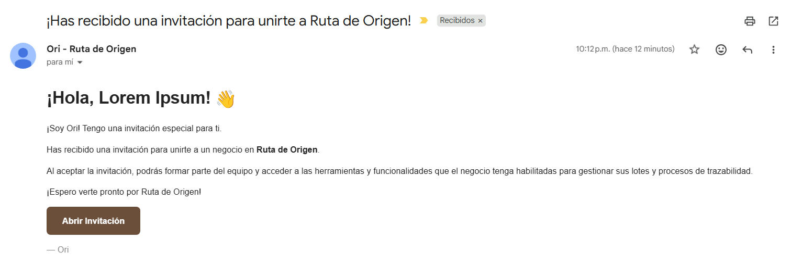

# PoC 04: Envío de correos transaccionales con Resend

Prueba de concepto (PoC) que implementa el envío de correos transaccionales utilizando **Resend** y **Go**. Simula el flujo de invitación de un negocio a un usuario dentro de Ruta de Origen, con una plantilla HTML propia y marcado de prioridad en el correo.

## Arquitectura y Justificación

Delegar el envío de correos a un proveedor especializado como **Resend** evita mantener infraestructura propia de SMTP y ofrece una API REST simple con SDKs oficiales. La lógica se separa en tres responsabilidades: construcción del cliente, plantillas de contenido y el envío en sí. Así el resto de la aplicación nunca depende directamente del SDK de Resend.

### Estructura del proyecto

```
poc-04-resend-emails/
├── cmd/
│   └── main.go            # Carga variables de entorno y ejecuta el caso de envío
├── internal/
│   └── email/
│       ├── client.go       # Construye el cliente de Resend a partir de RESEND_API_KEY
│       ├── sender.go        # Arma y envía el correo
│       └── template.go      # Plantillas de contenido
├── media/
│   └── email-test.png       # Evidencia del correo recibido en una prueba real
├── go.mod
└── go.sum
```
### Parámetros de Configuración (`.env.example`)

Todos los parámetros de configuración estan estructurados dentro del `.env`, por lo que puedes ver una plantilla en la carpeta de este PoC. (`.env.example`)

## Guía de Levantamiento

### 1. Configurar variables de entorno

Crear un archivo `.env` en la raíz del proyecto con las tres variables de la tabla anterior. Se cargan automáticamente al inicio.

### 2. Instalar dependencias

```bash
go get github.com/resend/resend-go/v4
go get github.com/joho/godotenv
go mod tidy
```

### 3. Ejecución

```bash
go run ./cmd
```

## Comportamiento Observado

- **Envío exitoso:** el correo de invitación llega correctamente al destinatario, con el remitente mostrado como `Ori - Ruta de Origen`.
- **Marcado de prioridad:** los headers `Importance`, `X-Priority` y `X-MSMail-Priority` marcan el correo como de alta prioridad en el cliente de destino.
- **Plantilla HTML:** el cuerpo del correo respeta el formato definido en `template.go`, incluyendo el botón de acción hacia la invitación.
- **Trazabilidad:** cada envío exitoso imprime el ID del mensaje devuelto por Resend, permitiendo rastrear el correo del lado del proveedor.



## Stack Tecnológico

- **Lenguaje:** Go (Golang)
- **Proveedor de Email:** Resend (`resend-go/v4`)
- **Configuración:** `godotenv`